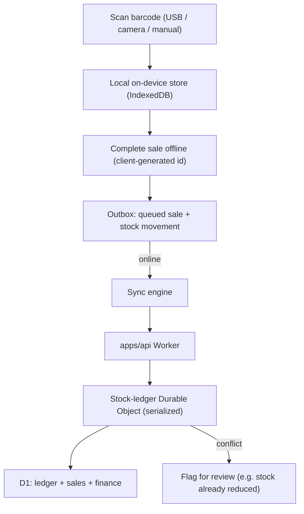
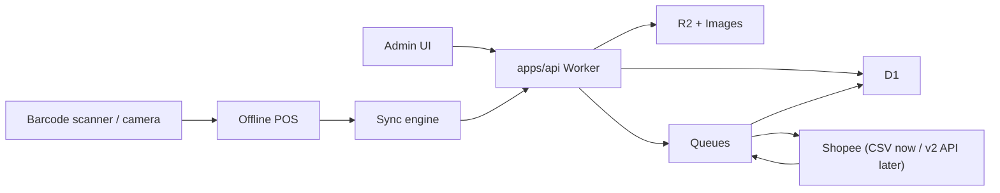
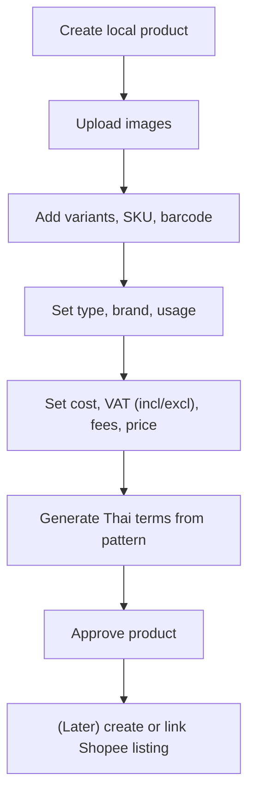

# Architecture

Confirmed stack (see [DECISIONS.md](DECISIONS.md)): **Next.js + TypeScript** on **Cloudflare
Workers** (OpenNext), **Cloudflare D1** + **Drizzle**, **npm workspaces**, **Vitest**. On-site
selling is **offline-first**, kept consistent by a **Durable Object** stock ledger. Shopee is an
isolated boundary module (CSV adapter now, API adapter later).

> **The authoritative backend design — compute, data, storage, queues, secrets, auth, deploy — is
> in [CLOUDFLARE_ARCHITECTURE.md](CLOUDFLARE_ARCHITECTURE.md).** This file covers the app-level
> module boundaries and flows that are independent of the hosting platform.

## Monorepo Layout

```
apps/
  admin/       # Next.js admin UI + offline-first POS (PWA) — Workers via OpenNext
  api/         # Cloudflare Worker: API, /sync endpoint, Shopee adapter, queue consumers, ledger DO
  storefront/  # Next.js 15 customer storefront (AirPlus) — own Worker; shares api's D1 + KV + StockLedger DO
packages/
  core/     # Pure-TS domain logic: pricing, profit, tax, cost methods, stock ledger, terms
  db/       # D1 schema + migrations via Drizzle
docs/
```

`packages/core` has **no framework or I/O dependencies** — it operates on plain inputs and returns
plain results, so all money and stock logic is unit-testable without a database, browser, or
Shopee. `apps/*` and `packages/db` depend on `core`, never the reverse.

## Core Modules

- **Auth & Audit** — users, roles, append-only audit trail for sensitive changes.
- **Product Catalog** — products, variants, images, categories (type/brand/usage), Thai terms.
- **Inventory** — stock ledger, barcode lookup, locations, reservations, sync queue.
- **Pricing & Finance** — cost methods, tax (per-product inclusive/exclusive), fee profiles,
  profit projection and actuals, pricing history.
- **Sales** — on-site (offline-first) sales, Shopee order import, refunds, cancellations, exports.
- **Shopee Integration (boundary)** — CSV adapter (now) and v2 API adapter (later): auth, token
  refresh, product/order import, stock/listing sync, push/poll.
- **Storefront (customer-facing)** — the AirPlus storefront (`apps/storefront`): guest checkout,
  phone-OTP customer accounts, coupons/campaigns, banners, and affiliate items. Shares the back
  office's D1; domain logic that has shipped to the back office lives in `core` with its tables in
  `db`, but storefront-only features still ship client-side first — coupons are currently a
  localStorage mock (`apps/storefront/src/lib/coupons.ts`, `/coupons` catalog + `/account/coupons`
  wallet) with no backend or `db` tables yet, and will move into `core`/`db` when a real coupon
  backend ships (campaigns and payments similarly are planned but not yet persisted).

## Offline-First POS Design

The POS must complete sales with no internet, then reconcile.



Rules:

- Product catalog, prices, and a stock snapshot are cached locally for lookup.
- Each offline sale carries a **client-generated id**; the server upserts on it (idempotent).
- Stock movements are **deltas** appended to the ledger, so concurrent on-site/online sales add up
  rather than overwrite. Negative available stock is blocked unless an owner override is recorded.
- Sync conflicts (oversell, externally-changed stock) are surfaced, not silently resolved.

## Data Flow



## Product Creation Flow



## Security Design

- Shopee credentials/refresh tokens stored outside source control (managed secret store).
- Least-privilege staff roles; owner-only for the sensitive actions in REQUIREMENTS A5.
- Append-only audit logs.
- Store the minimum necessary customer data from Shopee orders.
- Storefront customer login is **phone-OTP** (primary): SMS-provider credentials (ThaiBulkSMS /
  Twilio) and Cloudflare Turnstile keys live in the managed secret store, never in source control.
  PDPA consent is captured when the account is created (the OTP verify step); OTP dev-echo (fixed
  code, no SMS) is confined to the storefront's `env.staging` config, so production issues random
  codes via a real SMS provider.

## Environments

Managed with **Wrangler environments** (see [CLOUDFLARE_ARCHITECTURE.md](CLOUDFLARE_ARCHITECTURE.md)).

- **Local:** `wrangler dev` (Miniflare) with local D1/R2/KV; Shopee sandbox if available; secrets in `.dev.vars`.
- **Staging:** the `env.staging` config with its own D1/R2/KV/Queues, connected to a Shopee test app/shop where possible.
- **Production:** the `env.production` config — D1 (with backups/export), R2, monitoring, and Secrets Store.

## Why `packages/core` Is Framework-Free

Pricing, tax, cost-method, and stock-ledger logic is the money-critical, fully-specified part of
the system. Keeping it as pure functions lets it be developed test-first and reused by both the API
and the offline POS without duplicating rules. Shopee response shapes never leak into it.
