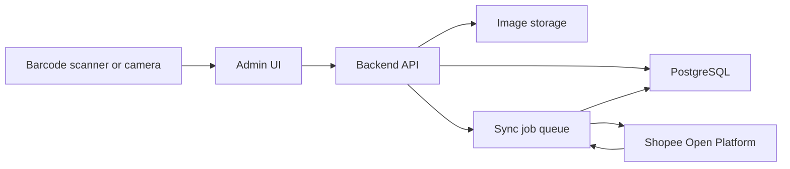
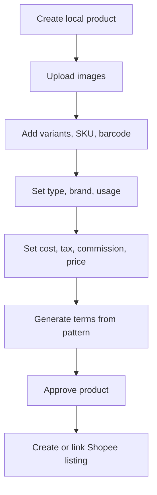
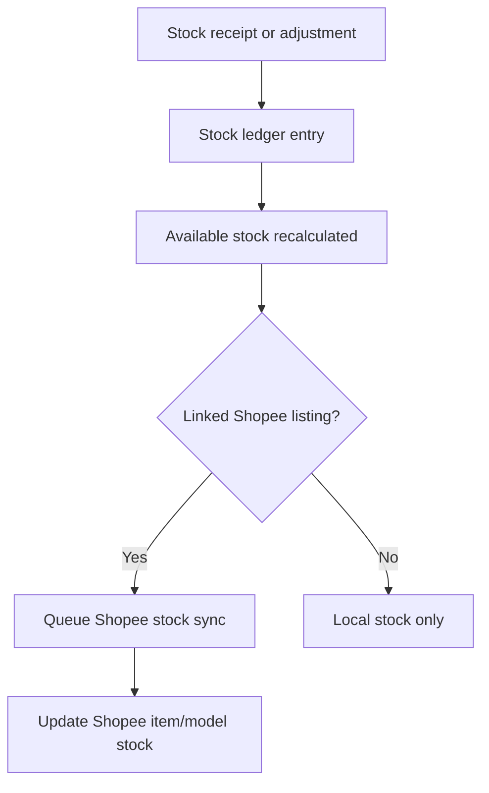

# Architecture

## Proposed Default

Use a web-based admin app with a typed backend and relational database.

This is a proposal, not a final decision. Confirm the stack before implementation.

## Recommended Stack

- Frontend: Next.js or React with TypeScript.
- Backend: Node.js with TypeScript, either Next.js server routes for a small MVP or a separate API service for cleaner scaling.
- Database: PostgreSQL.
- ORM/migrations: Prisma or Drizzle.
- File storage: S3-compatible object storage, Supabase Storage, or local storage for development.
- Background jobs: queue for Shopee sync, image upload, order import, and stock update retries.
- Barcode scanning: USB scanner as keyboard input plus browser camera scanning fallback.
- Testing: unit tests for core calculations and stock ledger; integration tests for API routes; browser tests for critical admin workflows.

## Core Modules

- Admin UI: product, inventory, sales, finance, settings, and Shopee connection screens.
- Product Catalog: product master data, variants, images, categories, and terms.
- Inventory: stock ledger, barcode lookup, locations, reservations, and sync queue.
- Pricing: formulas, fee profiles, tax rules, profit projections, and pricing history.
- Sales: Shopee order import, on-site sale creation, refunds, cancellations, and exports.
- Shopee Integration: authorization, token refresh, product sync, stock sync, order import, and push/poll handling.
- Audit: immutable event trail for sensitive changes.

## High-Level Flow

## Product Creation Flow

## Inventory Flow

## Security Design

- Store Shopee credentials and refresh tokens outside source control.
- Keep least-privilege roles for staff.
- Require owner role for deleting products, overriding negative stock, changing tax settings, and publishing Shopee sync changes.
- Keep audit logs append-only.
- Avoid storing unnecessary customer personal data from Shopee orders.

## Environments

- Local development: local database, local file storage or development bucket, Shopee sandbox/test mode if available.
- Staging: production-like environment connected to test Shopee app/shop where possible.
- Production: managed database, backups, object storage, monitoring, and secure secret store.

## Implementation Note

Shopee integration should be a boundary module. Core logic should accept normalized local objects and not directly depend on Shopee response shapes. This makes pricing, inventory, and sales logic testable without live Shopee calls.
