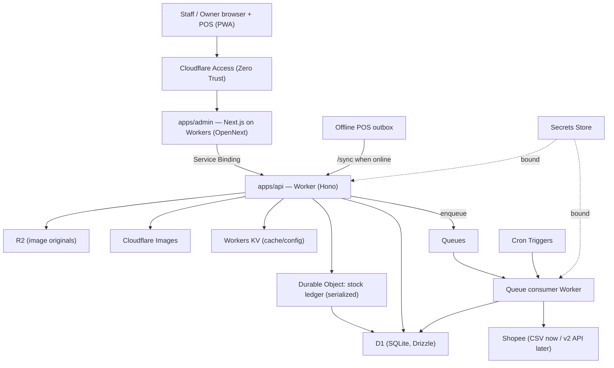
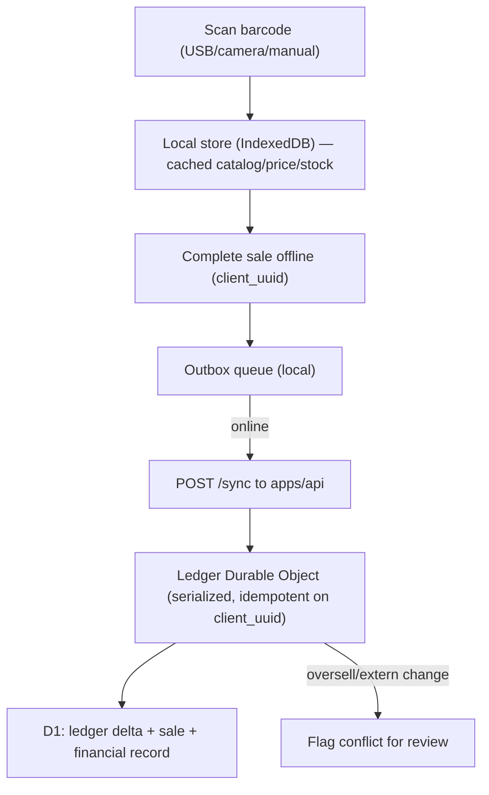

# Cloudflare Architecture

The backend runs on the **Cloudflare developer platform**. This document is the authoritative
design for compute, data, storage, async work, security, and deployment. It is grounded in current
Cloudflare docs (verified June 2026). Confirmed choices live in [DECISIONS.md](DECISIONS.md).

## Why Cloudflare here

A single Thai seller's back office is read-mostly with bursty POS writes and periodic marketplace
sync. Cloudflare gives us one integrated platform — edge compute, a serverless database, object
storage, queues, and strong-consistency primitives — with a generous free tier and no egress fees,
and it keeps the **offline-first POS** correct via Durable Objects.

## Service mapping

| Concern | Cloudflare product | Role |
| --- | --- | --- |
| Admin UI + POS | **Workers** via **OpenNext** (`@opennextjs/cloudflare`) | Next.js App Router app (`apps/admin`) as a PWA |
| API + jobs | **Workers** | `apps/api` request handler, sync endpoint, Shopee adapter, queue consumers |
| Storefront (public) | **Workers** via **OpenNext** (`@opennextjs/cloudflare`) | Customer-facing AirPlus car-parts store (`apps/storefront`); shares api's D1 + KV, cross-binds the stock-ledger DO; authenticates customers via phone-OTP (persists session + OTP-throttle state) |
| Database | **D1** (serverless SQLite) | System of record; accessed with **Drizzle ORM** |
| Stock consistency | **Durable Objects** | Serialize stock-ledger writes; idempotent offline-sale apply |
| Object storage | **R2** | Product image originals (S3-compatible, no egress fees) |
| Image processing | **Cloudflare Images** binding | Resize / optimize / variants / watermark |
| Async work | **Queues** (+ dead-letter queue) | Shopee sync, order import, stock push, image jobs |
| Scheduled work | **Cron Triggers** | Shopee order polling, token refresh (API phase) |
| Cache / config | **Workers KV** | POS catalog snapshot, fee/tax config, feature flags |
| Secrets | **Secrets Store / Worker secrets** | Shopee partner key, refresh tokens, auth secret |
| Auth (edge) | **Cloudflare Access (Zero Trust)** | SSO/MFA gate for the internal back office |
| Edge security | **WAF, Rate Limiting, Turnstile, TLS, DNS** | Protect login + sync endpoints |
| Observability | **Workers Logs / Logpush, Tail Workers, Analytics Engine** | Logs + custom sales/stock metrics |

## Topology



`apps/admin` calls `apps/api` over a **Service Binding** (in-process, no public Internet hop).
`packages/core` (pure pricing/tax/cost/stock/terms logic) is imported by both — Shopee response
shapes never leak into it.

## Compute: Workers + OpenNext

- **`apps/admin`** — Next.js App Router, deployed with the **OpenNext Cloudflare adapter**.
  Requires `compatibility_flags = ["nodejs_compat"]` and a `compatibility_date` ≥ `2024-09-23`,
  an `open-next.config.ts`, and the `opennextjs-cloudflare build|preview|deploy` scripts. Static
  assets are served via the Workers `assets` binding. Configure it as a **PWA** for offline POS.
- **`apps/api`** — a Worker (recommend **Hono** for routing/middleware ergonomics) that owns
  business endpoints, the offline-sync endpoint, the Shopee boundary, and queue consumers. Keep it
  thin: validate input, enforce RBAC, call `packages/core`, persist via Drizzle/D1, route stock
  mutations through the ledger Durable Object.
- **`apps/storefront`** — the customer-facing **AirPlus** car-parts storefront (Next.js App Router,
  deployed with the **OpenNext Cloudflare adapter**). It is its own Worker (`airplus-storefront`),
  separate from admin/api but on the **same Cloudflare account** — bindings do not cross accounts —
  so it binds the **same D1 database (`DB`)** and **KV** as `apps/api` (a D1 database can be bound by
  multiple Workers; KV is read-only here for the checkout PromptPay target, and the storefront also
  persists its own customer auth state — `storefront_sessions`, `throttle` — for phone-OTP login) and cross-binds the
  stock-ledger **Durable Object** (`STOCK_LEDGER` → `StockLedger`) via `script_name`. The DO class
  stays owned by `apps/api`, so that binding resolves only after api has deployed it (and not in
  local `next dev`).
- Prefer **Service Bindings** (`services` in wrangler config) for admin→api calls.
- For a smaller MVP, the API can live inside `apps/admin` as Next.js route handlers; split into a
  dedicated Worker when sync/jobs grow. Either way the boundary modules stay the same.

## Data: D1 + Drizzle

- **D1** is the system of record. Bind it as `DB`; manage schema with **Drizzle** + `drizzle-kit`
  (generates SQL migrations) applied via `wrangler d1 migrations apply`. Optionally set a D1
  **jurisdiction** to keep data in-region.
- **Money is stored as `INTEGER` minor units (satang)** — never floats. THB has 2 decimals, so
  `satang = Math.round(thb * 100)`. `packages/core` computes in THB decimals (rounded with
  `round2`, half away from zero); the persistence boundary converts to/from satang. Rates are
  stored as integer basis points (e.g. 7% → `700`) or as text; never binary floats.
- Enums are `TEXT` with CHECK constraints; timestamps are `INTEGER` epoch milliseconds (UTC),
  rendered in **Asia/Bangkok** at the edges.
- Key invariants enforced in D1: `onsite_sales.client_uuid` UNIQUE (idempotent offline sync),
  `(channel, external_order_id)` UNIQUE (no duplicate online imports), `barcodes.barcode_value`
  UNIQUE. See [DATA_MODEL.md](DATA_MODEL.md).

**Alternative — Hyperdrive + Postgres.** If the catalog/sales volume outgrows D1's limits or you
need Postgres features, keep Postgres (Neon/Supabase/RDS) and accelerate it from Workers with
**Hyperdrive** (Cloudflare's binding example uses `compatibility_flags = ["nodejs_compat_v2"]`;
with a `compatibility_date` ≥ `2024-09-23` the plain `nodejs_compat` flag already provides
equivalent behavior). Then money can use Postgres `NUMERIC` and the satang convention is optional. Choose D1 for simplicity/cost; switch to
Hyperdrive+Postgres only when a real limit is hit.

## Strong consistency: Durable Objects for the stock ledger

Stock correctness is the heart of the system: on-site (possibly offline) sales and online (Shopee)
sales both decrement the same stock, and an offline sale may sync minutes later. Cloudflare
recommends **Durable Objects** exactly for this ("operations must be serialized … inventory
management").

- One Durable Object per **coordination atom**. MVP: one **ledger DO per shop** serializes all
  stock mutations (simple and correct). Scale later to **one DO per `product_variant`** (+location)
  for throughput.
- The DO is the single writer for stock: it appends **ledger deltas** (never overwrites a count),
  recomputes available stock, blocks negative stock unless an owner override is recorded, and
  writes through to D1.
- **Idempotent offline apply:** each sale carries a `client_uuid`. The DO (and the D1 UNIQUE
  constraint) make replaying a queued offline sale a no-op, so a sale is never double-counted.
- **Conflict surfacing:** if applying a synced sale would oversell (because online stock already
  dropped), the DO flags it for review instead of silently overwriting.

## Offline-first POS flow



The PWA caches catalog, prices, and a stock snapshot in IndexedDB (seeded from KV/D1 while online).
Sales complete locally and sync idempotently. The UI shows online/offline state and unsynced count.

## Storage & images: R2 + Cloudflare Images

- **R2** bucket (binding `R2`) stores image originals — no egress fees, S3-compatible.
- **Cloudflare Images** binding (`IMAGES`) optimizes/resizes/watermarks on upload (transform the
  bytes, then store the result in R2) or transforms on the fly. The Images binding requires a paid
  Images plan. Serve via cached transformation URLs.

## Async: Queues + Cron Triggers

- **Queues** decouple slow/external work from requests: product sync, stock push, order import,
  image processing. Configure a consumer with `max_batch_size`, `max_batch_timeout`, `max_retries`,
  a `dead_letter_queue` (for poison messages), `max_concurrency`, and `retry_delay`. Alert on DLQ
  depth.
- **Cron Triggers** run scheduled Workers for Shopee order polling and token refresh once the API
  phase is live. MVP polls; push/webhooks added later.
- Never call Shopee directly from a UI request — enqueue a job.

## Cache & config: Workers KV

KV holds read-mostly data: the POS catalog snapshot, fee/tax config, feature flags, and role/session
lookups. KV is eventually consistent — fine for caches, never for authoritative stock or money
(those live in D1 / the ledger DO).

## Secrets

- Store the Shopee `partner_key`, OAuth **refresh tokens**, and the app auth secret as **Worker
  secrets** (`wrangler secret put`) or in the **Secrets Store**, bound to the api/consumer Workers.
  Declare required names with the `secrets.required` wrangler property (validated on deploy + typed).
- Local development uses **`.dev.vars`** (gitignored), never committed. Do not put secrets in
  `vars`.
- Encrypt Shopee refresh tokens at rest (envelope encryption) and reference them by name — never
  store raw tokens in source or logs. See [SHOPEE_INTEGRATION.md](SHOPEE_INTEGRATION.md).

## Auth: Cloudflare Access + app RBAC

- Put the admin app behind **Cloudflare Access (Zero Trust)** so it is not publicly reachable
  without SSO/MFA (email OTP or Google). The Worker validates the Access JWT
  (`Cf-Access-Jwt-Assertion`).
- Enforce the four app roles (owner / manager / stock_operator / finance_viewer) in `apps/api`,
  backed by D1. Owner-only actions per REQUIREMENTS A5.
- Use **service tokens** for machine-to-machine (cron, CI). The POS obtains a short-lived session
  while online and operates from cache when offline, re-syncing on reconnect.

### Storefront customer auth (public storefront)

The public storefront is **not** behind Cloudflare Access; it authenticates end customers itself via
**phone-OTP** at `/login` (login | register mode tabs). New members see a PDPA consent panel;
verification uses a 6-box OTP with a resend countdown. `POST /api/auth/otp/send` enforces a
registration gate (login → existing/registered numbers only; register → new numbers only);
`POST /api/auth/otp/verify` enforces the consent invariant. Sessions and send-throttling are tracked
in `storefront_sessions` and `throttle`. A **Turnstile** seam guards OTP send. Staging sets
`OTP_DEV_ECHO` to echo the code instead of sending SMS (never enabled in production).

## Edge security

Cloudflare **WAF**, **Rate Limiting** (back-office login + `/sync`, and the storefront
`POST /api/auth/otp/send` OTP-send throttle), **Turnstile** on back-office login and (seam) on
storefront OTP send, managed TLS, and DNS sit in front by default. Bot protection on public endpoints.

## Environments

Use **Wrangler environments** (the `env.staging` / `env.production` keys in `wrangler.jsonc`) —
bindings are **not inheritable**, so each environment names its own D1 database, R2 bucket, KV
namespace, and queues.
Deploy with `wrangler deploy --env production`. Local dev uses `wrangler dev` (Miniflare) with local
D1/R2/KV simulations; mark services that aren't simulated locally with `remote: true`. Per-environment
secrets via `.dev.vars.<env>`.

## Example `wrangler.jsonc` (apps/api)

```jsonc
{
  "$schema": "node_modules/wrangler/config-schema.json",
  "name": "l-shopee-api",
  "main": "src/index.ts",
  "compatibility_date": "2026-06-05",
  "compatibility_flags": ["nodejs_compat"],
  "observability": { "enabled": true },
  "d1_databases": [
    { "binding": "DB", "database_name": "l-shopee", "database_id": "<id>", "migrations_dir": "../../packages/db/migrations" }
  ],
  "r2_buckets": [{ "binding": "R2", "bucket_name": "l-shopee-images" }],
  "kv_namespaces": [{ "binding": "KV", "id": "<kv-id>" }],
  "images": { "binding": "IMAGES" },
  "queues": {
    "producers": [{ "binding": "SHOPEE_QUEUE", "queue": "l-shopee-sync" }],
    "consumers": [
      {
        "queue": "l-shopee-sync",
        "max_batch_size": 10,
        "max_batch_timeout": 30,
        "max_retries": 5,
        "dead_letter_queue": "l-shopee-sync-dlq",
        "max_concurrency": 3,
        "retry_delay": 60
      }
    ]
  },
  "durable_objects": { "bindings": [{ "name": "STOCK_LEDGER", "class_name": "StockLedger" }] },
  "secrets": { "required": ["AUTH_SECRET", "SHOPEE_PARTNER_KEY"] },
  "triggers": { "crons": ["*/15 * * * *"] },
  "env": {
    "production": {
      "d1_databases": [{ "binding": "DB", "database_name": "l-shopee-prod", "database_id": "<prod-id>" }],
      "r2_buckets": [{ "binding": "R2", "bucket_name": "l-shopee-images-prod" }],
      "kv_namespaces": [{ "binding": "KV", "id": "<prod-kv-id>" }]
    }
  }
}
```

> Values like `database_id` and KV ids are created with `wrangler d1 create` / `wrangler kv namespace create`. The Durable Object class needs a **top-level `migrations` entry** on first deploy (a sibling of `durable_objects`, as shown in the example above).

## CI/CD

- Run `npm ci → lint → typecheck → test` (existing GitHub Actions), then deploy with **Workers
  Builds** or a deploy job: `wrangler d1 migrations apply --env production` then
  `opennextjs-cloudflare deploy` (admin) and `wrangler deploy --env production` (api).
- Configure build/runtime variables and secrets in the CI provider / `wrangler secret`; Workers does
  not share build-time and runtime variables, so set both.

## Observability

Enable **Workers Logs** (`observability.enabled`) and Logpush; use **Tail Workers** for structured
processing and **Analytics Engine** for custom sales/stock/fee metrics queried via SQL. Add Sentry
for error tracking. Monitor queue backlog and DLQ depth.

## Bindings summary (api Worker)

| Binding | Product | Purpose |
| --- | --- | --- |
| `DB` | D1 | System of record (Drizzle) |
| `STOCK_LEDGER` | Durable Object | Serialized stock mutations + idempotent sale apply |
| `R2` | R2 | Image originals |
| `IMAGES` | Cloudflare Images | Image transforms |
| `KV` | Workers KV | Catalog snapshot, config, flags |
| `SHOPEE_QUEUE` | Queues | Async Shopee/import/image jobs |
| `AUTH_SECRET`, `SHOPEE_PARTNER_KEY` | Secrets | Auth + Shopee key (by reference) |

## Cost & limits (single-seller scale)

D1, Workers, KV, Queues, and Durable Objects all sit comfortably in the free/low-paid tiers for one
shop; R2 has no egress fees. **Cloudflare Images requires a paid plan** for its binding. Watch D1's
per-database size limit as historical sales accumulate — archive/export old finance data, or move to
Hyperdrive+Postgres if a hard limit approaches. The owner already has Cloudflare accounts available
for hosting.
