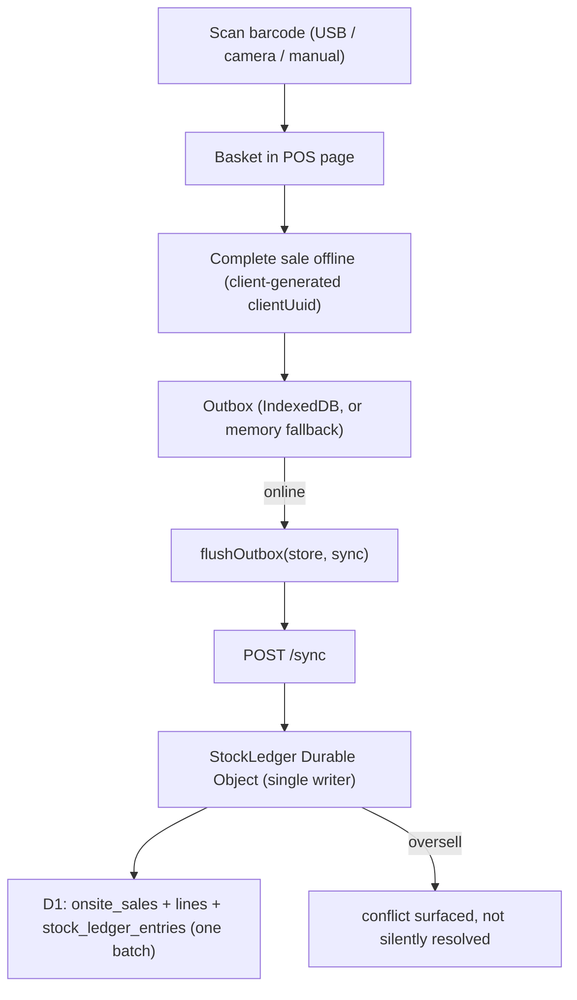

# Module — Offline-First POS & Sync

The on-site sale path: scan → sell offline → queue locally → flush to the server when online, with the
server as the single source of truth for stock. Designed so a sale is **never lost or double-counted**.

Related: stock math in [MODULE_CORE_LOGIC.md](MODULE_CORE_LOGIC.md) (`stock.ts`, `sync.ts`);
`/sync` + `/stock/adjust` contracts in [API_REFERENCE.md](API_REFERENCE.md).

## Files

| File | Role |
| --- | --- |
| `apps/admin/src/app/pos/page.tsx` | POS screen — barcode entry, basket, payment, complete sale (works offline). |
| `apps/admin/src/lib/outbox.ts` | Pure outbox: `QueuedSale`, `flushOutbox(store, sync)`, `createMemoryStore()`. Storage abstracted behind `OutboxStore` so flush logic is unit-testable. |
| `apps/admin/src/lib/outbox-idb.ts` | Browser-only IndexedDB adapter implementing `OutboxStore` (memory store is the fallback when IndexedDB is unavailable). |
| `apps/api/src/index.ts` → `POST /sync` + `class StockLedger` | Server side: idempotent persistence through the single-writer Durable Object. |

## Flow

## Idempotency & conflict model (the invariants)

- Every offline sale carries a **client-generated `clientUuid`**. `POST /sync` dedupes on it
  (server-applied + in-batch via `partitionByClientUuid`), and **D1's unique index on
  `onsite_sales.client_uuid` is the backstop** — re-flushing an already-synced sale is harmless.
- `flushOutbox` removes a sale from the queue **only on success**; failures/throws keep it for the
  next flush. So a flaky network retries safely.
- Stock applies as **ledger deltas** through the `StockLedger` Durable Object (single writer, so
  concurrent on-site + online syncs serialize). Oversell is **blocked and returned as a
  `conflict`**, never silently resolved or written as negative stock.
- The sale + its lines + the ledger entries are written in **one D1 batch** so a sale can't half-land.

## Status & next steps

- Built: POS page, the pure outbox + IndexedDB adapter, `/sync`, the `StockLedger` DO, `/stock/adjust`.
- Not yet hardened: PWA/offline reliability testing (service worker, real airplane-mode runs), and
  the conflict-review UI (conflicts are returned by the API but surfacing them to the cashier is
  minimal). See [STATE_OF_THE_BUILD.md](STATE_OF_THE_BUILD.md) §5.
